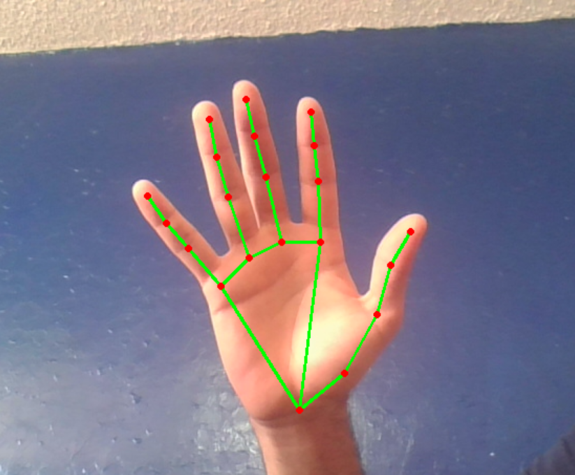

# Simple-Hand-Tracking
this program allows you to use the camera to detect hands in the image and to point out the reference points. It also prints a Landmark of the position of each point on the terminal.

## Required libraries
+ Mediapipe
+ Opencv

## configuración del programa
Para selecciónar la camara sera necesario cambiar la siguiente linea de codigo. En caso de tener una laptop con camara integrala se utilizara el 0, pero en caso de tener una camara externa generalmente se usa 1.

```python
cap=cv2.VideoCapture(0)
```
## Example 

